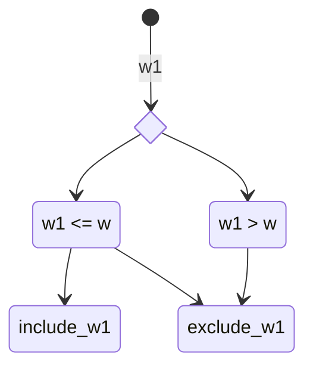

# 0/1 KnapSack

| | Item 1 | Item 2 | Item 3 | Item 4 |
|--|--|--|--|--|
| value[] | 1 | 4 | 5 | 7 |
| weight[] | 1 | 3 | 4 | 5 |

**MaxWeight**: 7

- What is the maximum value with limited weight
- We can select one item once

## Steps
1. Recursion
    - Base Condition: Smalles Valid Input
2. Memoziation
3. Bottom Up

### Choice Diagram

### Memoisation
- n x m = capacity x nsize => value | profit

| | Item 1 | Item 2 | Item 3 | Item 4 |
|--|--|--|--|--|
| value[] | 1 | 4 | 5 | 7 |
| weight[] | 1 | 3 | 4 | 5 |

| (v,w) | c0 | c1 | c2 | c3 | c4 | C5 | C6 | c7 |
|--|--|--|--|--|--|--|--|--|
|n0|0|0|0|0|0|0|0|0|
|n1(1, 1)|0|1|1|1|1|1|1|1|
|n2(4, 3)|0|1|1|4|5|5|5|5|
|n3(5, 4)|0|1|1|4|5|6|6|9|
|n4(7, 5)|0|1|1|4|5|7|8|9|

## How to identify 0/1 Knapsack?
- Array of items
- Capacity
- Choice
- Ans: Max profit or subset